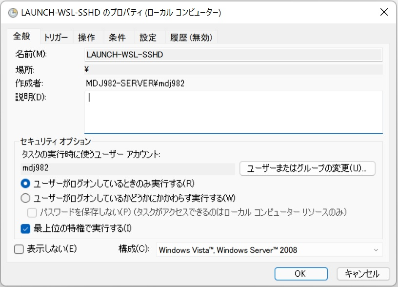
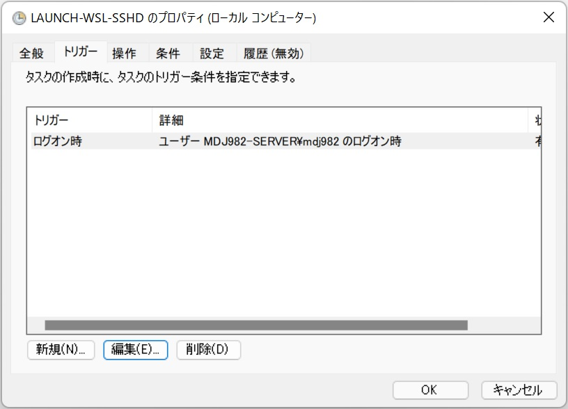
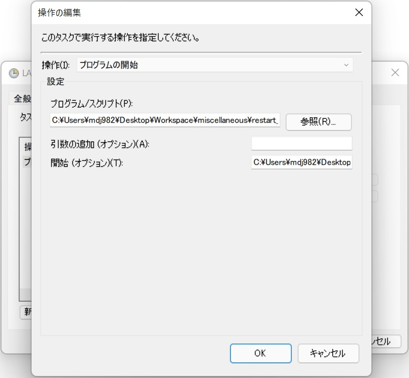

# Utility Settings <!-- omit in toc -->

- [Mozc](#mozc)
  - [Install Mozc (Ubuntu 18.04 LTS)](#install-mozc-ubuntu-1804-lts)
  - [GNOME GUI Settings (Ubuntu 20.04 LTS)](#gnome-gui-settings-ubuntu-2004-lts)
  - [Trouble Shootings](#trouble-shootings)
- [SSH settings](#ssh-settings)
  - [Server side](#server-side)
  - [SSH keys](#ssh-keys)
  - [Scripts](#scripts)
- [Device blacklist](#device-blacklist)
- [C++, update-alternative](#c-update-alternative)
- [Switch shell to bash](#switch-shell-to-bash)
- [User accounts](#user-accounts)
- [Fix IP address](#fix-ip-address)
- [About time (hardware clock vs system clock)](#about-time-hardware-clock-vs-system-clock)
- [About network card](#about-network-card)
- [About disk extension](#about-disk-extension)
- [SSH Connection to WSL2](#ssh-connection-to-wsl2)
  - [On WSL2](#on-wsl2)
  - [On Windows](#on-windows)
- [Upgrade Ubuntu](#upgrade-ubuntu)

## Mozc
- Mozc currently works well in default Ubuntu 20.04 LTS.

### Install Mozc (Ubuntu 18.04 LTS)
```bash
$ tar -xf mozc-2.23.2815.102+dfsg~ut2-20171008d+20200227.tar.xz
$ cd mozc-2.23.2815.102+dfsg~ut2-20171008d+20200227/
$ sed -i s/'const bool kActivatedOnLaunch = false;'/'const bool kActivatedOnLaunch = true;'/g mut/src/unix/ibus/property_handler.cc
$ sudo apt install -y devscripts autoconf automake autopoint autotools-dev build-essential debhelper dh-autoreconf dh-strip-nondeterminism dpkg-dev fcitx-bin fcitx-libs-dev g++ g++-7 gcc gcc-7 gir1.2-fcitx-1.0 gir1.2-gtk-2.0 gir1.2-harfbuzz-0.0 gyp icu-devtools libasan4 libatk1.0-dev libatomic1 libc-dev-bin libc6-dev libcairo-script-interpreter2 libcairo2-dev libcilkrts5 libdbus-1-dev libdrm-dev libegl1-mesa-dev libexpat1-dev libfcitx-config4 libfcitx-core0 libfcitx-gclient1 libfcitx-qt0 libfcitx-utils0 libfile-stripnondeterminism-perl libfontconfig1-dev libfreetype6-dev libgcc-7-dev libgcroots-dev libgcroots0 libgdk-pixbuf2.0-dev libgettextpo0 libgl1-mesa-dev libgles2-mesa-dev libglib2.0-dev libglib2.0-dev-bin libglu1-mesa-dev libglvnd-core-dev libglvnd-dev libgraphite2-dev libgtk2.0-dev libgwengui-cpp0 libgwengui-qt5-0 libgwengui-qt5-dev libgwenhywfar-core-dev libgwenhywfar-data libgwenhywfar60 libharfbuzz-dev libharfbuzz-gobject0 libibus-1.0-dev libice-dev libicu-dev libicu-le-hb-dev libicu-le-hb0 libiculx60 libitm1 liblsan0 libmng2 libmpx2 libopengl0 libpango1.0-dev libpcre16-3 libpcre3-dev libpcre32-3 libpcrecpp0v5 libpixman-1-dev libpng-dev libprotobuf-dev libprotobuf-lite10 libprotoc10 libpthread-stubs0-dev libpython-dev libpython-stdlib libpython2.7-dev libqt4-dbus libqt4-declarative libqt4-network libqt4-script libqt4-sql libqt4-xml libqt4-xmlpatterns libqt5concurrent5 libqt5designer5 libqt5opengl5 libqt5printsupport5 libqt5sql5 libqt5test5 libqt5xml5 libqtcore4 libqtdbus4 libqtgui4 libquadmath0 libqwt-headers libqwt-qt5-6 libqwt-qt5-dev libsigsegv2 libsm-dev libstdc++-7-dev libtool libtsan0 libubsan0 libuim-custom2 libuim-dev libuim-scm0 libuim8 libwayland-bin libwayland-dev libx11-dev libx11-xcb-dev libxau-dev libxcb-dri2-0-dev libxcb-dri3-dev libxcb-glx0-dev libxcb-present-dev libxcb-randr0-dev libxcb-render0-dev libxcb-shape0-dev libxcb-shm0-dev libxcb-sync-dev libxcb-xfixes0-dev libxcb1-dev libxcomposite-dev libxcursor-dev libxdamage-dev libxdmcp-dev libxext-dev libxfixes-dev libxft-dev libxi-dev libxinerama-dev libxml2-utils libxrandr-dev libxrender-dev libxshmfence-dev libxxf86vm-dev libzinnia-dev linux-libc-dev m4 make mesa-common-dev ninja-build pkg-config po-debconf protobuf-compiler python python-dev python-minimal python-pkg-resources python2.7 python2.7-dev python2.7-minimal python3-distutils python3-lib2to3 qdbus qt5-qmake qt5-qmake-bin qtbase5-dev qtbase5-dev-tools qtchooser qtcore4-l10n x11proto-composite-dev x11proto-core-dev x11proto-damage-dev x11proto-dev x11proto-dri2-dev x11proto-fixes-dev x11proto-gl-dev x11proto-input-dev x11proto-randr-dev x11proto-xext-dev x11proto-xf86vidmode-dev x11proto-xinerama-dev xorg-sgml-doctools xtrans-dev zlib1g-dev
$ sudo ./build_mozc_plus_utdict
$ sudo dpkg -i ./mozc-data_*.deb ./mozc-server_*.deb ./mozc-utils-gui_*.deb ./ibus-mozc_*.deb
```

### GNOME GUI Settings (Ubuntu 20.04 LTS)
(Ctrl-s) Region & Language -> Confirm Ibus -> Add Japanese (Mozc) etc.

### Trouble Shootings
- Key assignments will be reset to US keys whenever rebooted. =>
  It Seems to be an internal bug. Adding the built-in Japanese (Roman only) at the top of the language list might work.

## SSH settings

### Server side

- Install openssh-server
  ```bash
  $ dpkg -l | grep ssh
  # if no name with "openssh-server", run the next line
  $ sudo apt install openssh-server
  $ dpkg -l | grep ssh
  # "openssh-server" should exists
  ```

- Check hostname
  ```bash
  $ ip addr # or ifconfig
  # find the static ipv6 address:
  # inet6 xxxx:xxxx:xxxx:xxxx:xxxx:xxxx:xxxx:xxxx/64 scope global ...
  $ hostname
  # enabled in DNS servers
  ```

- Confirm ssh directory
  ```
  $ mkdir -p ~/.ssh
  $ chmod 700 ~/.ssh
  $ touch ~/.ssh/authorized_keys
  $ chmod 600 ~/.ssh/authorized_keys
  ```

### SSH keys
Location:
~/.ssh/

Format in ~/.ssh/config:
```
Host [short name]
    HostName [IP address or domain name]
    User [user name]
    # Port 22
    IdentityFile ~/.ssh/keys/[pem file]
    ServerAliveInterval 60
```

Example for GitHub:
```
Host github.com
    User mdj982
    # Port 22
    IdentityFile ~/.ssh/keys/[pem file]
    ServerAliveInterval 60
```

Generate key:
```bash
$ mkdir -p ~/.ssh/keys
$ ssh-keygen -t ed25519 -f ~/.ssh/keys/[filename_without_extension].pub
$ chmod 600 ~/.ssh/keys/[filename_without_extension].pem
$ cat ~/.ssh/keys/[filename_without_extension].pub | ssh [short name] "cat >> ~/.ssh/authorized_keys"
```

### Scripts

- Client side

  ```bash
  NAME=name_foo # or github.com etc.
  HOST_NAME=192.168.xxx.xxx # #{NAME} by default
  USER_NAME=mdj982
  KEY_NAME=key_foo

  mkdir -p ~/.ssh && chmod 700 ~/.ssh
  mkdir -p ~/.ssh/keys && chmod 700 ~/.ssh/keys
  touch ~/.ssh/config && chmod 600 ~/.ssh/config
  ssh-keygen -t ed -b 4096 -f ~/.ssh/keys/${KEY_NAME}
  mv ~/.ssh/keys/${KEY_NAME} ~/.ssh/keys/${KEY_NAME}.pem
  echo "Host ${NAME}" >> ~/.ssh/config
  echo "    HostName ${HOST_NAME}" >> ~/.ssh/config
  echo "    User ${USER_NAME}" >> ~/.ssh/config
  echo "    # Port 22" >> ~/.ssh/config
  echo "    IdentityFile ~/.ssh/keys/${KEY_NAME}.pem" >> ~/.ssh/config
  echo "    ServerAliveInterval 60" >> ~/.ssh/config
  cat ~/.ssh/keys/${KEY_NAME}.pub # PUBKEY
  ```


- Server side

  ```bash
  PUBKEY=""
  mkdir -p ~/.ssh && chmod 700 ~/.ssh
  mkdir -p ~/.ssh/keys && chmod 700 ~/.ssh/keys
  touch ~/.ssh/config && chmod 600 ~/.ssh/config
  touch ~/.ssh/authorized_keys && chmod 600 ~/.ssh/authorized_keys
  echo ${PUBKEY} >> ~/.ssh/authorized_keys
  ```

## Device blacklist
Location:
/etc/modproble.d/blacklist.conf

Hint:
blacklist uas
blacklist usb_storage

## C++, update-alternative
```bash
$ sudo apt install -y gcc-10 g++-10
$ gcc-10 --version
$ g++-10 --version
$ sudo update-alternatives --install /usr/bin/gcc gcc `which gcc-10` 1020 # version to int
$ sudo update-alternatives --install /usr/bin/g++ g++ `which g++-10` 1020 # version to int
```

## Switch shell to bash
```bash
$ echo $SHELL
# /bin/sh
$ chsh -s /bin/bash
$ exit
$ echo $SHELL
# /bin/bash
```

## User accounts

- Create a user
  ```bash
  $ sudo useradd -m -s /bin/bash [username]
  $ sudo passwd [username]
  # enter new password
  ```

- Delete a user (with home directory)
  ```bash
  $ sudo userdel -r [username]
  # be careful !!! (Do not remove root user)
  ```

- Set a sudo password
  ```bash
  $ sudo -i
  # passwd
  ```

- Make home folder invisible from other users
  ```bash
  $ chmod 700 /home/${USER}
  ```

- Add to group

  ```bash
  $ sudo gpasswd -a ${USER} sudo
  $ sudo usermod -aG sudo ${USER}
  ```

- Confirm group
  ```bash
  $ sudo getent group | grep sudo
  ```

- Erase from group
  ```bash
  $ sudo gpasswd -d ${USER} sudo
  ```

- The whole sequence (sudo the following commands)
  ```bash
  #!/bin/bash
  MY_NAME=mdj982
  useradd -m -s /bin/bash ${MY_NAME}
  echo "${MY_NAME}:tmppasswd" | chpasswd
  gpasswd -a ${MY_NAME} sudo
  mkdir /home/${MY_NAME}/.ssh
  chmod 700 /home/${MY_NAME}/.ssh
  touch /home/${MY_NAME}/.ssh/authorized_keys
  chmod 600 /home/${MY_NAME}/.ssh/authorized_keys
  chown -R ${MY_NAME}:${MY_NAME} /home/${MY_NAME}/.ssh
  echo "ssh-rsa ..." > /home/${MY_NAME}/.ssh/authorized_keys
  ```

## Fix IP address

- Ubuntu Server => netplan: `/etc/netplan/99-anyname.yaml`

  - ethernet
    ```
    network:
        version: 2
        ethernets:
            eth0: # adapter
                dhcp4: false
                dhcp6: false
                addresses: [192.168.zzz.xxx/24] # fixed IP
                gateway4: 192.168.zzz.1
                nameservers:
                    addresses: [192.168.zzz.1]
    ```


  - wireless
    ```
    network:
        version: 2
        wifis:
            wlan0: # wireless adapter
                dhcp4: false
                addresses: [192.168.xxx.xxx/24] # fixed IP
                gateway4: 192.168.xxx.1
                nameservers:
                    addresses: [192.168.xxx.1]
                access-points:
                    foo: # ssid
                        password: bar # password
    ```

- Ubuntu Desktop: `/etc/NetworkManager/system-connections/*`
- systemd-networkd: `/etc/systemd/network/20-wired.network`
  ```
  [Match]
  Name=eth0

  [Network]
  Address=192.168.xxx.xxx/24
  Gateway=192.168.xxx.xxx
  DNS=xxx.xxx.xxx.xxx
  #DNS=xxx.xxx.xxx.xxx
  ```

## About time (hardware clock vs system clock)
```bash
$ sudo hwclock -D --systohc --localtime
```

## About network card
- Disable: Windows -> "Device Manager" -> "Network Adapter" -> "Power Management" -> "Wake on Magic Packet from power off state"

## About disk extension
- Check UUID of the partition

    ```
    $ sudo blkid /dev/sda1
    ```

- write into `/etc/fstab`. (Replace `<uuid>`)

    ```
    UUID=<uuid> /media/extssd0 ext4 users,suid,dev,exec,rw,auto,async 0 0
    ```

## SSH Connection to WSL2

### On WSL2

- `sudo vim /etc/sudoers.d/sudo_service_without_passwd`
  ```
  mdj982 ALL=NOPASSWD: /usr/sbin/service ssh restart
  ```
  - This setting allows `sudo /usr/sbin/service ssh restart` to run without password for the specific user

### On Windows

- Prepare a *.ps1 script as follows
  ```ps1
  netsh advfirewall firewall delete rule name="Open Port for WSL2"
  # netsh advfirewall firewall show rule name="Open Port for WSL2"
  netsh advfirewall firewall add rule name="Open Port for WSL2" dir=in action=allow protocol=TCP localport=2222
  $wsl_ip = (wsl hostname -I).trim()
  wsl sudo service ssh restart
  netsh interface portproxy delete v4tov4 listenport=2222
  # netsh interface portproxy show v4tov4
  netsh interface portproxy add v4tov4 listenport=2222 connectaddress=$wsl_ip connectport=22
  ```
  - Open firewall on port 2222
  - forward to port 22 on wsl from listen port 2222 for any listen address

- Prepare a launch.vbs script as follows
  ```ps1
  command = "C:\Windows\System32\WindowsPowerShell\v1.0\powershell.exe  -ExecutionPolicy Bypass C:\Users\mdj982\Desktop\Workspace\miscellaneous\restart_and_forward_wsl_sshd.ps1"
  set shell = CreateObject("WScript.Shell")
  shell.Run command,0
  ```
  - Run the above *.ps1 script in background

- Launch APP "Task Scheduler" and let the script run after each Windows reboot
  
  
  
  - (path to `launch.vbs`)
  - (blank)
  - (Any safe directory)

- Reboot Windows and now you can connect to `<Windows IP address>:2222` without logging in windows.

## Upgrade Ubuntu

```bash
$ sudo apt update
$ sudo apt upgrade
$ sudo apt dist-upgrade
$ sudo apt install update-manager-core
$ sudo do-release-upgrade -d
```
